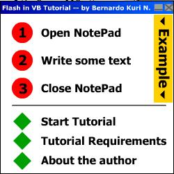



## Flash Tutorial \- Updated\!

### Description

Imagine for a second that you can make a complete GUI by yourself... all of it done in Flash. yes my friends, it is possible: you can also use Flash for your VB needs. This tutorial explains the steps needed for you to accomplish this. believe me... It's incredible. This update contains: 1)100% Windows NT/XP compatibility; 2)How to disable the right-click Flash menu (at last!); 3)How to include your Flash movie (SWF) into the executable file itself! No more worrying about your Flash movie being modyfied! NOTE: All these changes are explained in the "UPDATES.TXT" file, contained in the ZIP... (Oh, and BTW, I would greatly appreciate your votes and suggestions... they have helped before, and i'm sure they'll help again... :)
 
### More Info
 
This tutorial assumes that you have working knowledge of VB and of Flash 4/5.

(BTW, you need to have the Flash ActiveX control installed for this program to work)

Joy and satisfaction, both to the developer and the end-user... :)

None (that i know of)

             |
---                |---
**Submitted On**   |2002-01-23 18:56:12
**By**             |[Bernardo Kuri N\.](https://github.com/Planet-Source-Code/PSCIndex/blob/master/ByAuthor/bernardo-kuri-n.md)
**Level**          |Intermediate
**User Rating**    |4.8 (91 globes from 19 users)
**Compatibility**  |VB 4\.0 \(32\-bit\), VB 5\.0, VB 6\.0
**Category**       |[VB function enhancement](https://github.com/Planet-Source-Code/PSCIndex/blob/master/ByCategory/vb-function-enhancement__1-25.md)
**World**          |[Visual Basic](https://github.com/Planet-Source-Code/PSCIndex/blob/master/ByWorld/visual-basic.md)
**Archive File**   |[Flash\_Tuto506471232002\.zip](https://github.com/Planet-Source-Code/bernardo-kuri-n-flash-tutorial-updated__1-21364/archive/master.zip)

### API Declarations

Lot's of 'em... You'll need to check the source code for the details...

